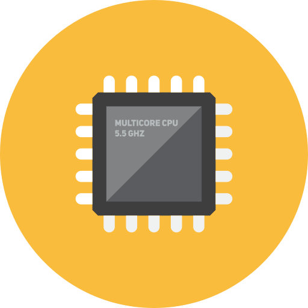

{: .center}

# Elektroniklådan - firmware och elektronik

Vi hjälper till med att
- [Skriva kod](#kod)
- [Utveckla elektronik](#utveckling)
- [Ta fram prototyper](#prototyp)
- [Jobba med trådlösa standarder](#iot)
- [Utbilda inom elektronik](#kurser)

Ta gärna [kontakt](#kontakt)!

## 🧑‍💻 Firmware och mjukvara 

- Utveckling av hela projekt, moduler eller bibliotek
- Språk som C, C++, Rust, Python och Javascript

## 🧑‍🏭 Elektronikutveckling 

- Komponentval och design av kopplingsschema
- Layout och montering av kretskort
- Utveckling av firmware

## 🚀 Startup 

Jobbar du på en affärsidé och behöver en prototyp för att visa värdet av din produkt? Elektroniklådan kan hjälpa till med framtagning av:

- Funktionell prototyp baserad på existerande moduler - för att se om produkten är kan tillverkas.
- Konceptuell prototyp baserad på egenkonstruerat kretskort - fokus på form och funktion.

## 📟 IoT 

Elektroniklådan har kompetens inom flera olika kommunikationsstandarder för trådlösa sensorer och andra smarta produkter, bland annat:

- Bluetooth
- IEEE 802.15.4
- NB-IoT
- LTE-M

## 🎓 Kurser 

Allt fler upptäcker nöjet i att lära sig elektronik och programering med Arduino, Raspberry Pi, Micropython och liknande. Elektroniklådan erbjuder workshops för både nybörjare och mer erfarna som vill bygga och programera sin egen IoT-pryl. En kurs passar också bra som teambuilding för en avdelning eller ett mindre företag med intresserade!

Exempel:

- Lär dig Arduino med ESP328266 och bygg din egen IoT-sensor med wifi, temperatur, luftfuktighet och LCD-skärm. *För intresserade nybörjare (4h).*
- Lär dig Micropython med ESP32 och bygg din egen IoT-sensor som övervakar krukväxter med ett antal sensorer, skärm och högtalare. *För den lite mer erfarne (4h).*
- Lär dig använda Balena för att trådlöst uppdatera din Raspberry Pi och bygg din egen skärm för väderprognoser. *För den lite mer erfarne (4h).*

## 🔌 Kontakt 

Ta gärna kontakt med Elektroniklådan:

- [kontakt@elektronikladan.se](mailto:kontakt@elektronikladan.se)
- [https://www.linkedin.com/in/albertskog/](https://www.linkedin.com/in/albertskog/)
